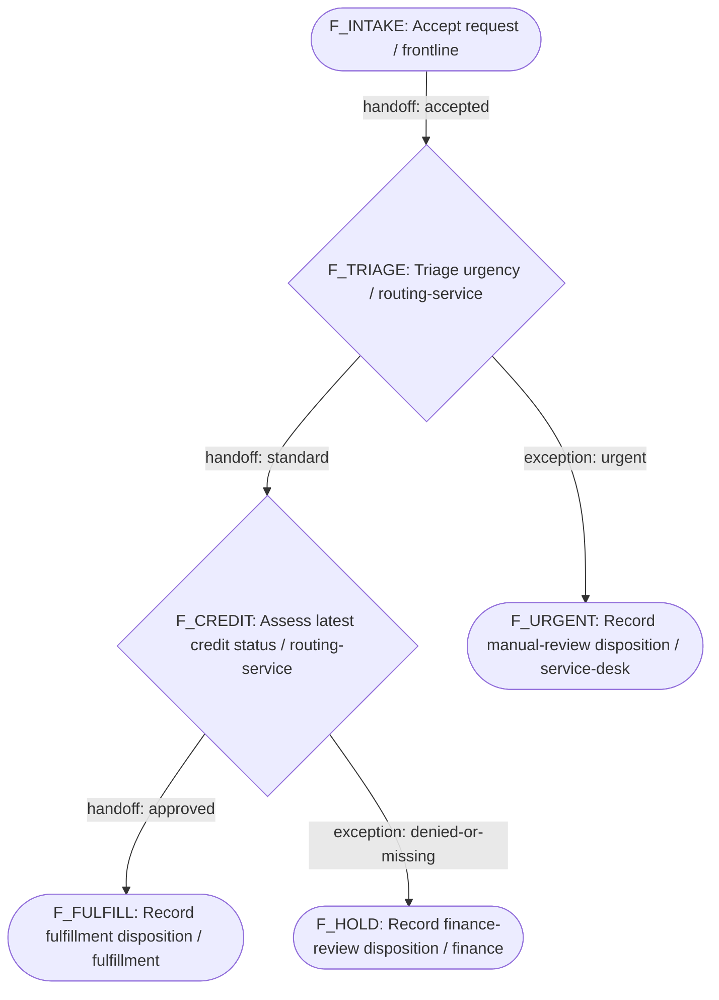

# Order triage exercise — proposed state

Derived from revision 53; as of 2026-09-09.

Active local simulation: **REL2**. No infrastructure deployment is recorded here.

| ID / variant | Actor / system / boundary | Inputs → outputs | Evidence / prerequisites |
| --- | --- | --- | --- |
| F_CREDIT / standard | routing-service / local-sqlite-router / internal | tenant, request ID, customer ID, urgency and available latest credit decision → request and routing context | P_CREDIT, S03, S07, S10 |
| F_FULFILL / standard | fulfillment / fulfillment-queue / internal | tenant, request ID, customer ID, urgency and available latest credit decision → attributed routing disposition | P_FULFILL, S03, S07, S10 |
| F_HOLD / standard | finance / credit-export / internal | tenant, request ID, customer ID, urgency and available latest credit decision → attributed routing disposition | P_HOLD, S03, S07, S10 |
| F_INTAKE / shared | frontline / intake-queue / internal | tenant, request ID, customer ID, urgency and available latest credit decision → request and routing context | P_INTAKE, S03, S07, S10 |
| F_TRIAGE / shared | routing-service / local-sqlite-router / internal | tenant, request ID, customer ID, urgency and available latest credit decision → request and routing context | P_TRIAGE, S03, S07, S10 |
| F_URGENT / urgent | service-desk / support-queue / support | tenant, request ID, customer ID, urgency and available latest credit decision → attributed routing disposition | P_URGENT, S03, S07, S10 |

## Gaps and coverage

No structural gaps found in the declared map.

## Handoffs and paths

| From → to | Kind / condition | Payload | Receiver |
| --- | --- | --- | --- |
| F_CREDIT → F_FULFILL | handoff / approved | tenant, request ID, customer ID, urgency, latest credit status | fulfillment |
| F_CREDIT → F_HOLD | exception / denied-or-missing | tenant, request ID, customer ID, urgency, latest credit status | finance |
| F_INTAKE → F_TRIAGE | handoff / accepted | tenant, request ID, customer ID, urgency, latest credit status | routing-service |
| F_TRIAGE → F_URGENT | exception / urgent | tenant, request ID, customer ID, urgency, latest credit status | service-desk |
| F_TRIAGE → F_CREDIT | handoff / standard | tenant, request ID, customer ID, urgency, latest credit status | routing-service |

## Declared coverage

Covered means an attributed account exists for the declared step; it does not establish exhaustive or independently verified coverage.

| Dimension / value | Status | Steps | Source locators / gap |
| --- | --- | --- | --- |
| exception / urgent | covered | P_TRIAGE | S03 complete captured fixture document; S04 complete captured fixture document; S10 complete captured fixture document  |
| exception / denied-or-missing | covered | P_CREDIT | S03 complete captured fixture document; S04 complete captured fixture document; S10 complete captured fixture document  |
| stakeholder / finance | covered | P_CREDIT, P_HOLD | S03 complete captured fixture document; S04 complete captured fixture document; S10 complete captured fixture document  |
| stakeholder / frontline | covered | P_INTAKE | S03 complete captured fixture document; S04 complete captured fixture document; S10 complete captured fixture document  |
| stakeholder / fulfillment | covered | P_FULFILL | S03 complete captured fixture document; S04 complete captured fixture document; S10 complete captured fixture document  |
| stakeholder / operations | covered | P_TRIAGE | S03 complete captured fixture document; S04 complete captured fixture document; S10 complete captured fixture document  |
| stakeholder / service-desk | covered | P_URGENT | S03 complete captured fixture document; S04 complete captured fixture document; S10 complete captured fixture document  |
| variant / shared | covered | P_INTAKE, P_TRIAGE | S03 complete captured fixture document; S04 complete captured fixture document; S10 complete captured fixture document  |
| variant / standard | covered | P_CREDIT, P_FULFILL, P_HOLD | S03 complete captured fixture document; S04 complete captured fixture document; S10 complete captured fixture document  |
| variant / urgent | covered | P_URGENT | S03 complete captured fixture document; S04 complete captured fixture document; S10 complete captured fixture document  |

## Knowledge

| Claim | Status / freshness | Sources and locators |
| --- | --- | --- |
| CL_KEYS: Tenant is part of request and customer identity; approvals/handoffs have event grain | verified / current | S05 complete captured fixture document; SRC_SETUP complete captured fixture document |
| CL_OWNER: Service desk owns urgent manual review | verified / current | S03 complete captured fixture document; S04 complete captured fixture document |

## Resume

Current task: Bounded simulation complete

Stage: operate

Next action: **Review operating handoff; validate real inputs and authorization before adapting for production**

Completed:

- Ten-source reconciliation
- Current/proposed map
- Actual query and three criterion runs
- Verified incident recovery

Unresolved:

- Real deployment, input feed controls and field validation are outside this exercise

Relevant records: HANDOFF, INC_FEED, Q_ROUTES, COMP_ROUTER

Structural checks cannot prove that every stakeholder or real exception has been discovered.
