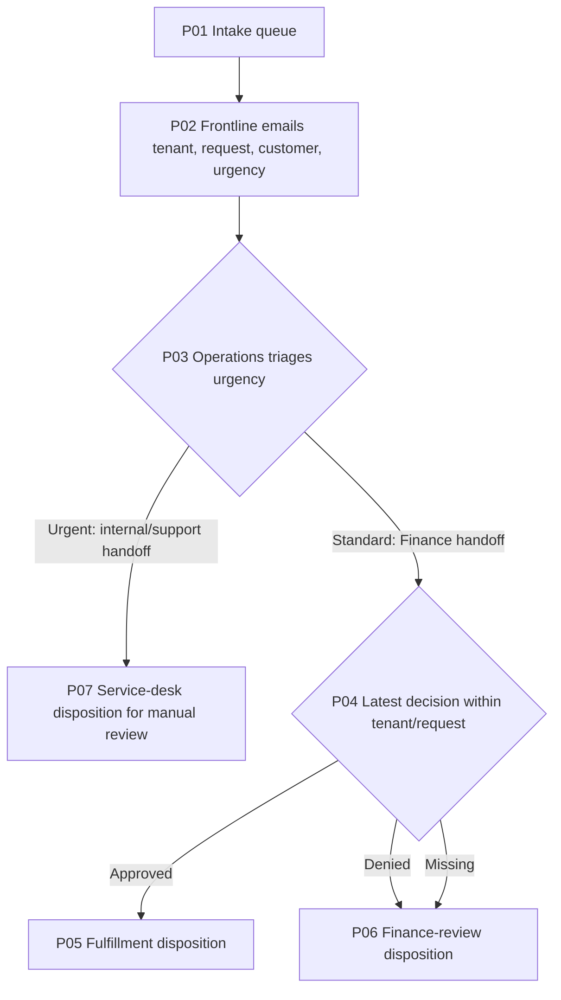

# Request-routing discovery handoff

Saved from private project revision 40, assessed 2026-09-09. **Ready to begin a fixed-fixture design; operational coverage and architecture are incomplete.**

Operations owns the bounded exercise from accepted intake to a recorded routing disposition. An urgent request goes to service-desk manual review. A standard request uses its latest Finance decision: approved goes to fulfillment; denied or missing goes to finance-review. The boundary ends before shipment or financial authorization. This is synthetic training material, and no service is deployed.

## What we recovered

The previous checkpoint was revision 4. It had one captured frontline interview (S01), seven reported claims (C01-C07), a provisional intake queue → copied email → Operations takeover map (P01-P03), owner unknown, and open ownership, downstream, urgent-route and status-delay questions (I01-I04). Its next action was an Operations walkthrough. The supplied new Operations and Finance accounts answer much of that need without relying on an earlier conversation.

Original first-interview artifacts and history remain available. C04/C06 still describe that interviewee's knowledge limits; they do not mean the project's current owner is unknown.

## Current reported map

Service desk and fulfillment are named receiving actors and system boundaries, not evidence of implemented integrations. CV08/CV09 retain their missing direct acknowledgements. “Covered” standard, urgent, denied and missing-decision branches mean attributed scenario coverage, not a live process test. Detailed payloads, owners, systems and source links are in current-state-resumed.md.

## Reconciled knowledge and provenance

| Conclusion | Evidence and standing |
| --- | --- |
| Operations owns accepted intake through routing disposition. | C10; S03 line 6, sentences 1 and 7; S10 line 6, sentences 1-2. Reported scenario policy. Canonical brief updated; I01 resolved. |
| Urgent exceptions belong to service-desk routing, not Finance. | C09/C20; S03 line 6, sentences 2-7; S04 line 6, sentence 5; S10 line 6, sentence 4. S03 states policy effective 2026-09-01. |
| Sales' older contrary account is retained as history. | S02 line 6, sentences 1-2 was unchecked last-quarter hearsay. C08 was explicitly superseded by C20; N02 records rationale and the original bilateral conflict remains in history. |
| Standard requests need the greatest decision_seq for their tenant/request. | C11; S04 line 6, sentences 1-4. A prior denial can later be approved. Missing and denied latest decisions remain separate reasons for finance-review. |
| Customer identity and all joins must preserve tenant. | C12/C14; S05 and S07 line 6; S11 lines 6-13. |
| Inputs model daily exports, and their capture date does not prove freshness. | C15; S08 line 6. Source bytes are versioned; no live feed or timestamp-based freshness evidence exists. |
| “Quick disposition” is the reported benefit, with no measured target. | C07/C18; S01 line 6, sentence 7; S02 line 6, sentence 3. I04 remains open. |

All supplied interviews are explicitly synthetic and have scenario/capture date 2026-09-09. Reported policy/practice has not been promoted to verified real-world evidence. Only direct fixed-fixture observations have verified claims, with same-day review boundaries.

## Data path and executed observations

| Asset | Grain / key | Use |
| --- | --- | --- |
| D01 intake.requests | One row per tenant, request_id | Driving set; preserve every request |
| D02 crm.customers | One row per tenant, customer_id | Tenant-safe customer enrichment |
| D03 finance.approvals | One event per tenant, request_id, decision_seq | Select greatest sequence before joining |
| D04 operations.handoffs | One event per tenant, request_id, event_seq | Select greatest sequence before joining |

S11 captures the exact setup.sql bytes. The current exploratory path is **S11 → D01-D04 → Q04 latest-event selection and tenant-key joins → S17 enriched rows**, with **Q05 → S18** profiling the source rows. S19 summarizes results and S20 captures the executed local procedure.

| Observation | Result | Evidence |
| --- | --- | --- |
| Reconstruction of the described bad joins | 13 rows, 4 distinct request keys, 6 cross-tenant customer rows | Q01/S12, C22; archived as unsuitable |
| Current candidate enrichment | 4 rows, all 4 request keys, zero cross-tenant customer rows | Q04/S17, C24 |
| Raw table counts | 4 requests, 3 customers, 4 approval events, 5 handoff events | Q05/S18, C25 |
| Checked keys, required-field nulls and references | Zero duplicate keys, required nulls and customer/approval/handoff orphans | Q05/S18 |
| Requests with no approval | One urgent request; zero standard requests | Q05/S18; I07 retains the missing-standard test gap |

The old report's actual SQL/output was not supplied. Q01 is our labeled reconstruction of the mechanism described by Reporting (S06), not a claimed recovery of the original report.

Q02/Q03 were earlier exploratory executions. Source-sentence corrections changed dependency fingerprints, so their evidence was preserved and the queries archived; Q04/Q05 were executed and bound again. SQL and results remained the same. Current design references use Q04/Q05.

| Fixture request | Latest decision | Latest handoff | Observed disposition |
| --- | --- | --- | --- |
| north/R1 | sequence 2, approved | sequence 2, Operations | fulfillment |
| north/R2 | sequence 1, denied | sequence 1, Operations | finance-review |
| north/R3 | absent, urgent | sequence 1, Operations | service-desk |
| south/R4 | sequence 1, approved | sequence 1, Operations | fulfillment |

The route expectations were defined from S10 before execution and matched actual output. SQLite execution and binding succeeded. These are discovery observations, not component acceptance evaluations, a release, or evidence about unobserved live work.

## The next design

REQ01 requires exactly one output for every supplied tenant/request key, without missing or additional keys. REQ02 requires tenant-isolated customer enrichment and tenant in outputs. REQ03 requires the four sponsor-specified routes above. These are deliberately separate critical requirements.

DEC01 recommends deterministic SQL/Python for the structured joins and exact policy. Model-directed routing would add uncertainty without solving a need for interpretation here. Humans retain service-desk and Finance review authority.

The next useful artifact is a fixture-only input/output/failure contract and proposed map with P01-P07 baseline links. Specify input version/hash, tenant/request identity, selected event sequences, disposition and reason, run provenance and failure reporting. Distinguish a legitimately missing per-request decision from an unavailable approval export. Q04's unresolved-input output is exploratory; production behavior for unsupported urgency, invalid fields or missing customers has not been agreed.

All eight architecture concerns AC01-AC08 are explicitly **deferred**, with rationale: scope enforcement, execution component, tools/data controls, persistent run state, current policy context, recovery, evaluation and operations. No implementing component or proposed architecture map is represented as complete.

## Consequential unknowns and simulated-user questions

- I02/CV08/CV09: Who at service desk and fulfillment confirms receipt, what payload do they accept, and what records the disposition?
- I03/I07: How should a missing standard decision differ from a lost approval feed, and what outcome should invalid or incomplete input produce?
- I04: What measured time-to-disposition or status-chase reduction would count as success?
- I05: Can the original failed report be supplied if its exact historical behavior needs certification?
- I06: Who would operate a future runtime, with what refresh checks, retention, access controls and monitoring?

These questions are saved for the simulated user; nobody was contacted. Fixed-fixture design can proceed independently. Direct receiver walkthroughs and live integration design remain unresolved.

## Checks and next-session handoff

Current-process check: **fail**, because service-desk and fulfillment direct coverage is missing. Architecture check: **fail**, because implementing components and all eight critical concerns remain deferred. Release check: **fail**, including those gaps, missing proposed map/evaluations and unverified operational knowledge. The saved audit and final-checks.json carry exact results; failure is not a reason to erase real gaps.

Next session: read the audit, checkpoint and resumed-context.json; use H01 and current Q04/Q05 evidence; specify the fixture-only design and planned component; then define separate tests for REQ01-REQ03 plus missing-standard-decision, malformed data and unavailable approval input before building. Future executed evaluations need pre-run target/brief fingerprints and fresh run identity/time. Reliability's requested incident/recovery rehearsal (S09) remains planned work, including retaining an open incident after unsuccessful recovery.

No production service, external message, release, activation or incident rehearsal was performed. Real deployment would additionally need a runtime, accountable operator, access and refresh controls, monitoring, applicable acceptance/recovery evidence and the corresponding authorization.

Canonical project: /Users/michaelburton/Documents/Codex/2026-09-09/i-w/work/novice-order-project. Preserve the entire directory: HEAD, history and source blobs are canonical; Markdown and context snapshots are derived.
